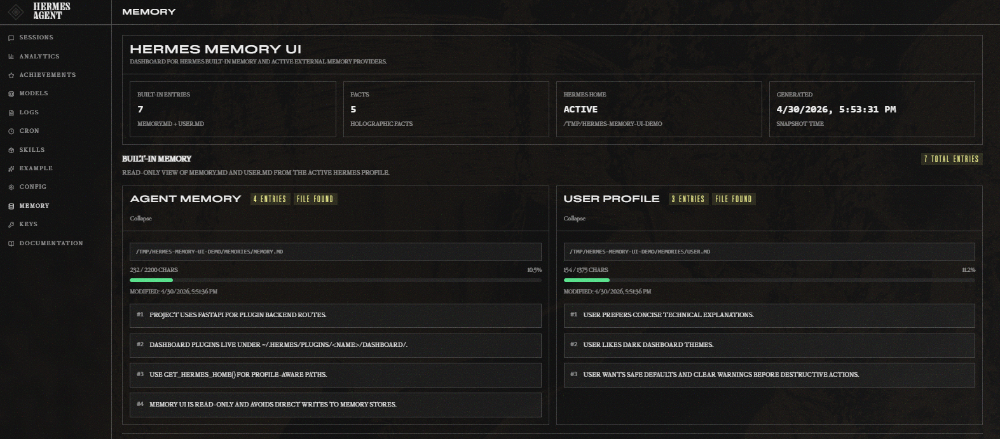
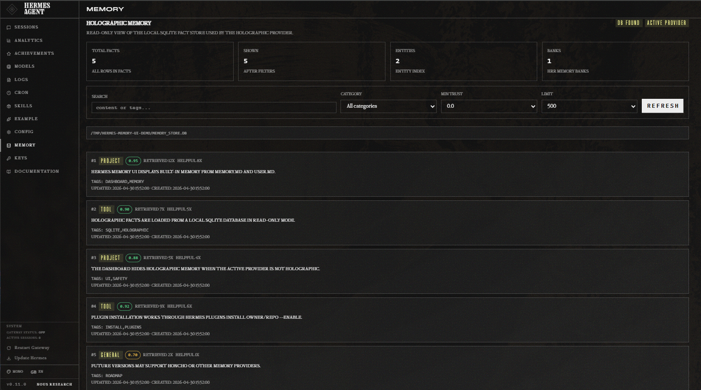

# Hermes Memory UI Plugin

Dashboard plugin for inspecting [Hermes Agent](https://github.com/NousResearch/hermes-agent) memory.

Current scope:

- Built-in memory:
  * `MEMORY.md` — agent notes / environment facts / project conventions
  * `USER.md` — user profile / preferences
- External memory provider:
  * Holographic memory: 
    + local SQLite fact store, default: `$HERMES_HOME/memory_store.db`
    + facts, categories, trust scores, retrieval counters, timestamps

This plugin is intentionally read-only. It does not add, edit, replace, or remove memories. That is deliberate: writes should go through Hermes' `memory` and `fact_store` tools or provider classes so validation, locking, mirroring, FTS, HRR vectors, and memory-bank maintenance are preserved.

## Screenshots

Built-in memory view:



Holographic memory view:



## Requirements

- Hermes Agent with web dashboard support.
- Dashboard plugin support as documented at:
  `https://hermes-agent.nousresearch.com/docs/user-guide/features/extending-the-dashboard`
- Optional: external memory provider enabled.

The built-in memory view works always, while external memory provider only when configured.

## Installation

### Install directly from GitHub

```bash
hermes plugins install xraysight/hermes-memory-ui --enable
```

### Update existing installation

```bash
hermes plugins update hermes-memory-ui
```

### Install from a local checkout

From this repository directory:

```bash
mkdir -p "${HERMES_HOME:-$HOME/.hermes}/plugins/hermes-memory-ui"
cp -R dashboard "${HERMES_HOME:-$HOME/.hermes}/plugins/hermes-memory-ui/"
```

### Reload the dashboard

If the dashboard is already running, force plugin discovery:

```bash
curl http://127.0.0.1:9119/api/dashboard/plugins/rescan
```

Then refresh the browser. A new `Memory` tab should appear.

If the plugin API route returns 404 after installing, restart the dashboard. Hermes mounts plugin backend routes at dashboard startup.

```bash
hermes dashboard
```

or stop/start your existing dashboard process/service.

## What the UI shows

Top summary:

- built-in entry count
- active Hermes home
- snapshot generation time
- holographic total fact count only when `memory.provider` is currently `holographic`

Built-in memory section:

- Agent memory card (`MEMORY.md`)
- User profile card (`USER.md`)
- path, file existence, modification time
- entry count and char usage bar
- parsed entries

Holographic memory section, displayed only when `memory.provider` is currently `holographic`:

- DB existence
- whether `memory.provider` is currently `holographic`
- total facts
- facts shown after filters
- entity count
- memory bank count
- filters for search, category, min trust, and limit
- fact cards with category, trust score, counters, content, tags, timestamps

## Holographic DB path resolution

The plugin reads the DB path from:

```yaml
plugins:
  hermes-memory-store:
    db_path: ...
```

If not configured, it falls back to:

```text
$HERMES_HOME/memory_store.db
```

`$HERMES_HOME`, `${HERMES_HOME}`, and `~` are expanded.

The SQLite connection is opened in read-only mode using `mode=ro`.

## API endpoints

Hermes mounts this plugin under:

```text
/api/plugins/hermes-memory-ui/
```

Available API endpoints:

### GET `/status`

Returns plugin status, active Hermes home, configured memory provider, built-in memory paths, and holographic DB path.

Example:

```bash
curl http://127.0.0.1:9119/api/plugins/hermes-memory-ui/status | jq
```

### GET `/builtin`

Returns parsed built-in memory stores:

- `memory` from `$HERMES_HOME/memories/MEMORY.md`
- `user` from `$HERMES_HOME/memories/USER.md`

Entries are split on Hermes' built-in delimiter §.

The response includes entry count, char count, configured/default char limits, usage percentage, file path, and modified timestamp.

### GET `/holographic`

Returns facts from holographic SQLite memory.

Query parameters:

- `limit`: 1-2000, default 500
- `category`: optional category filter, e.g. `user_pref`, `project`, `tool`, `general`
- `min_trust`: 0.0-1.0, default 0.0
- `search`: optional substring search over `content` and `tags`

Example:

```bash
curl 'http://127.0.0.1:9119/api/plugins/hermes-memory-ui/holographic?limit=100&min_trust=0.3' | jq
```

### GET `/snapshot`

Combined payload used by the UI. Accepts the same query parameters as `/holographic`.

```bash
curl http://127.0.0.1:9119/api/plugins/hermes-memory-ui/snapshot | jq
```

## Security notes

The plugin displays memory content. Treat this as private data.

Hermes dashboard plugin API routes are intended for the local dashboard. Do not expose the dashboard publicly with untrusted plugins installed. In particular, avoid binding the dashboard to `0.0.0.0` unless you understand the risk.

This plugin does not expose mutation endpoints, but it can reveal personal preferences, environment details, project facts, and other durable context stored in memory.

## Design decisions

### Why read-only first?

Memory writes are semantically loaded:

- Built-in memory has limits, delimiter parsing, locking, duplicate handling, and prompt-injection scanning.
- Holographic facts maintain FTS indexes, entity links, HRR vectors, trust scores, and memory banks.
- Built-in `memory(add)` may mirror into holographic memory, but `replace`, `remove`, and direct file edits do not reliably mirror.

A dashboard that writes directly to files or SQLite can silently corrupt memory semantics.

### Why plugin backend instead of direct browser access?

The browser cannot and should not read local files or SQLite directly. `plugin_api.py` runs inside the dashboard process, can resolve the active profile's `HERMES_HOME`, and can safely expose a narrow JSON API.

## Potential roadmap

Plugin extensions to consider (**feel free to contribute!**):

1. Safer mutation endpoints
   - built-in add/replace/remove via `tools.memory_tool.MemoryStore`
   - holographic add/update/remove via `plugins.memory.holographic.store.MemoryStore`
   - explicit warnings around mirroring and conflict semantics

2. Adapter abstraction
   - `BuiltinAdapter`
   - `HolographicAdapter`
   - future `HonchoAdapter`
   - future `Mem0Adapter`
   - future `HindsightAdapter`

3. Diff and hygiene tools
   - find duplicates
   - compare built-in entries mirrored to holographic facts
   - identify stale/low-trust facts
   - identify facts with no entities

4. Export
   - JSON export
   - Markdown export
   - redacted export for sharing/debugging

5. Better search
   - FTS5 query mode for holographic facts
   - entity filter
   - tag filter
   - date ranges

6. Optional dashboard slots
   - small memory usage widget in `config:top`
   - warning badge when built-in memory is near char limit

## Troubleshooting

### The Memory tab does not appear

Check plugin discovery:

```bash
curl http://127.0.0.1:9119/api/dashboard/plugins | jq
```

Force rescan:

```bash
curl http://127.0.0.1:9119/api/dashboard/plugins/rescan
```

Verify the file exists:

```bash
test -f ~/.hermes/plugins/hermes-memory-ui/dashboard/manifest.json && echo ok
```

### Backend endpoint returns 404

Plugin backend routes are mounted at dashboard startup. Restart `hermes dashboard`.

### Holographic section says DB missing

Check whether the DB exists:

```bash
test -f ~/.hermes/memory_store.db && echo exists
```

If you configured a custom path, inspect:

```bash
hermes config
```

Look for:

```yaml
plugins:
  hermes-memory-store:
    db_path: ...
```

### Browser console says SDK is undefined

The plugin script is loading before or outside the Hermes dashboard plugin runtime, or the dashboard crashed earlier. Refresh the dashboard and inspect browser devtools console/network.

## Current limitations

- Read-only only.
- Holographic search uses simple SQL `LIKE`, not FTS5 query syntax yet.
- Only local SQLite holographic memory is supported.
- Honcho/Mem0/Hindsight and other memory providers are not implemented.
- No pagination yet; use `limit` filter.

## License

MIT License. See [LICENSE](LICENSE).
