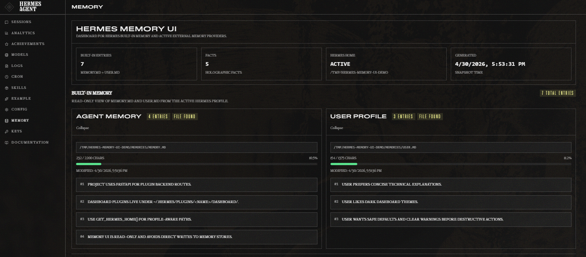
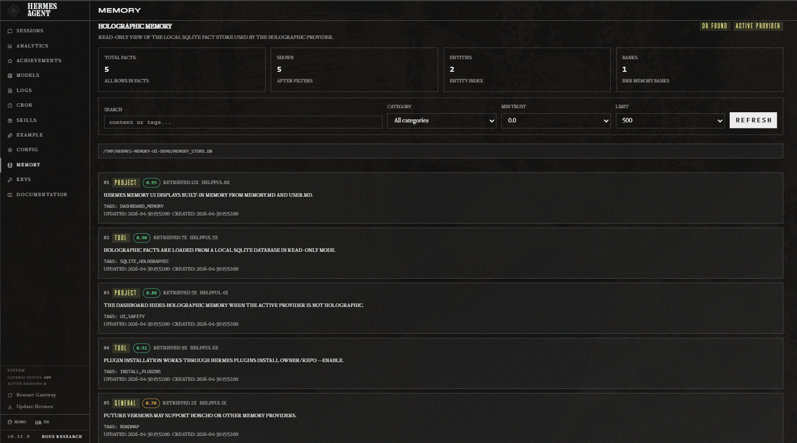
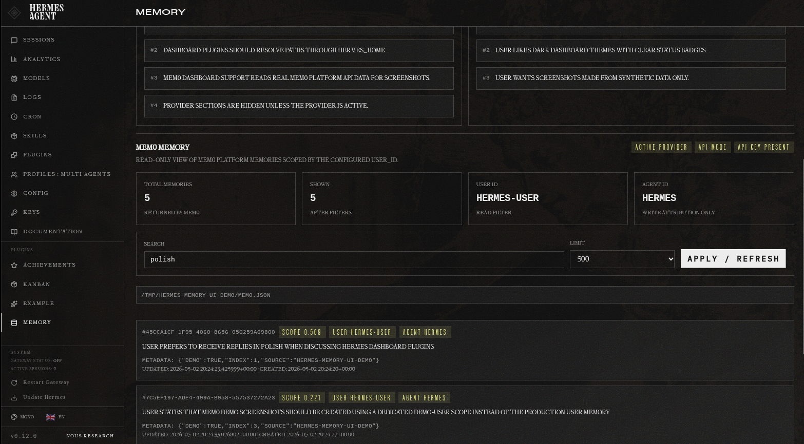
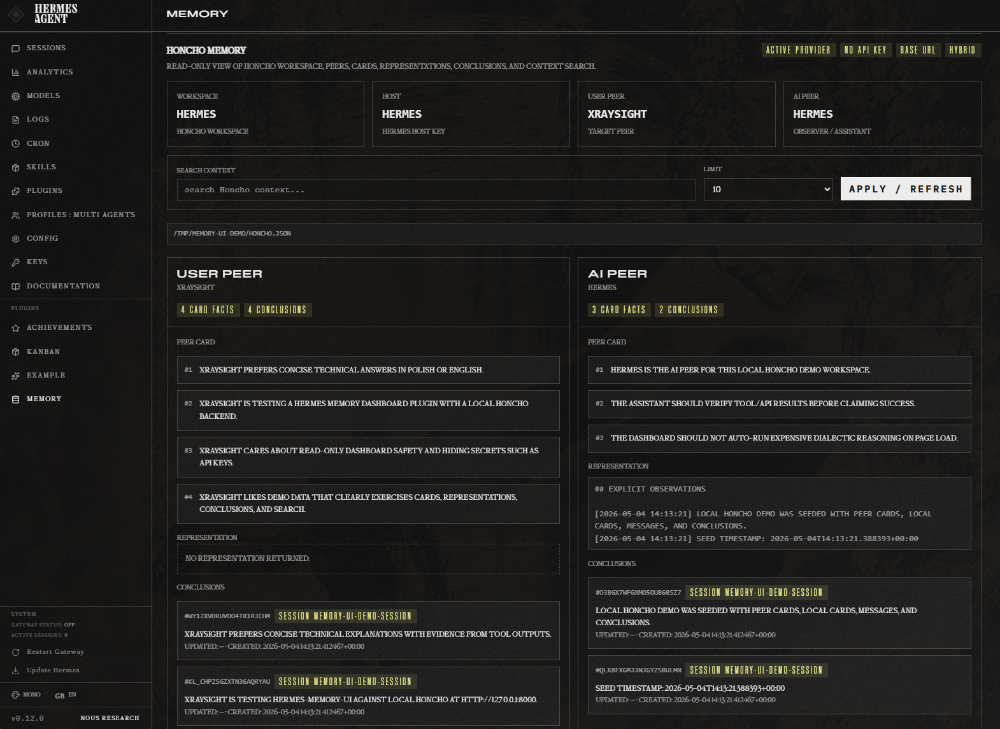
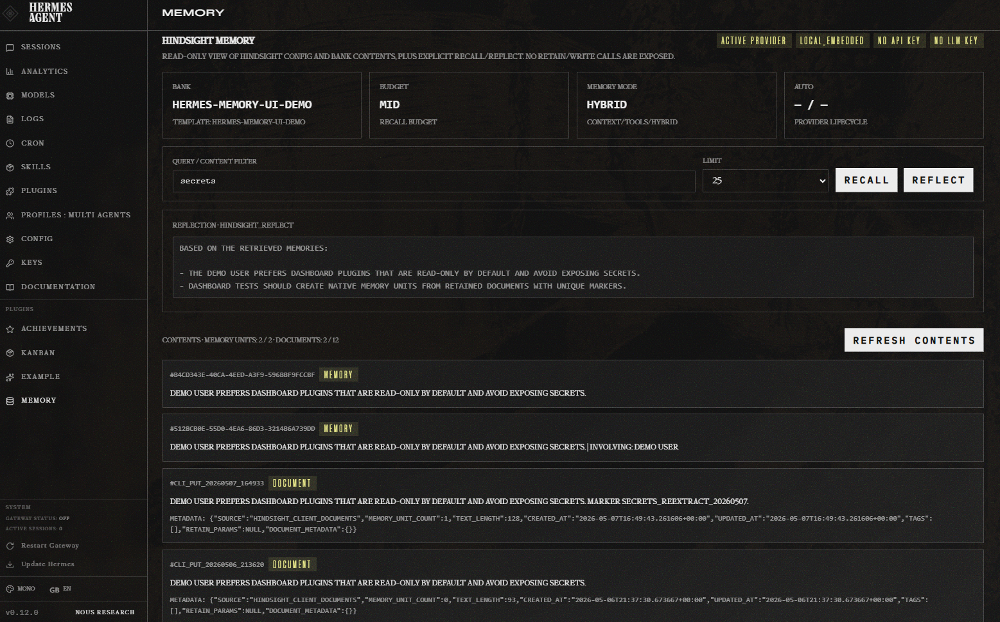
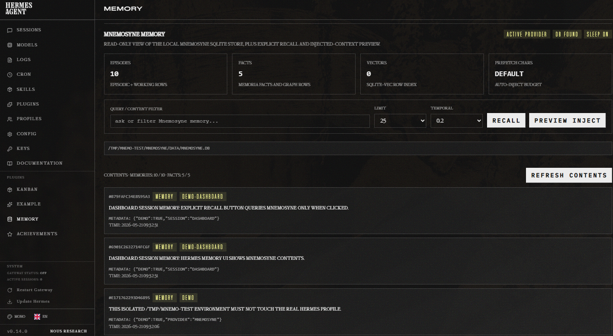
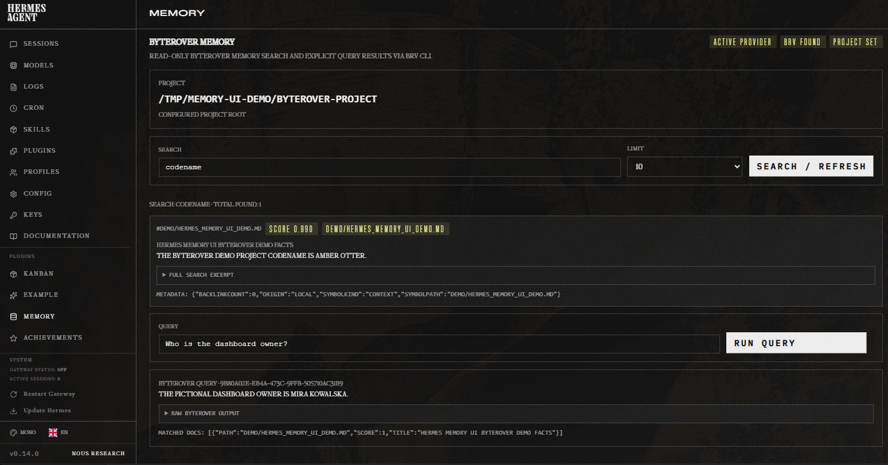

# Hermes Memory UI Plugin

Read-only [Hermes Agent](https://github.com/NousResearch/hermes-agent) plugin for inspecting memory in Hermes Dashboard and Hermes Desktop.

The Dashboard and Desktop interfaces are separate delivery artifacts. They share only the profile-aware Python backend API.

Current scope:

- Built-in memory:
  * `MEMORY.md` - agent notes / environment facts / project conventions
  * `USER.md` - user profile / preferences
- Session search:
  * explicit read-only search over previous Hermes sessions via Hermes' `session_search` tool
  * optional source/type filter such as CLI, Telegram, cron, Discord, web, or API sessions
- External memory providers:
  * Holographic memory:
    + local SQLite fact store, default: `$HERMES_HOME/memory_store.db`
    + facts, categories, trust scores, retrieval counters, timestamps
  * Mem0 memory:
    + read-only Mem0 Platform memories via Hermes' `mem0` provider config
    + memories, user/agent scope, scores returned by search, timestamps, metadata
  * Honcho memory:
    + read-only Honcho workspace, host, peer, and provider configuration state
    + user/AI peer cards, representations, conclusions, and context search
  * Mnemosyne memory:
    + read-only local SQLite store inspection for episodes, facts, instructions, gists, and graph rows
    + explicit recall and injected-context preview through the Hermes Mnemosyne provider
  * Hindsight memory:
    + read-only/query-only Hindsight provider configuration state
    + explicit recall and reflect actions; no automatic retain/write flow
    + contents view via the official Hindsight client for memory units and retained source documents
  * ByteRover memory:
    + read-only ByteRover CLI (`brv`) project status and registered locations
    + explicit BM25 search and optional query/synthesis action; no curate/write flow

This plugin is intentionally read-only. It does not add, edit, replace, or remove memories. That is deliberate: writes should go through Hermes' `memory` and `fact_store` tools or provider classes so validation, locking, mirroring, FTS, HRR vectors, and memory-bank maintenance are preserved.

## Screenshots

Current screenshots show the Hermes Dashboard interface. The Hermes Desktop interface exposes the same memory sources through a native full-page view.

Built-in memory view:



Holographic memory view:



Mem0 memory view:



Honcho memory view:



Hindsight memory view:



Mnemosyne memory view:



Byterover memory view:



## Requirements

- Hermes Agent with Hermes Dashboard or Hermes Desktop.
- For Dashboard: [dashboard plugin support](https://hermes-agent.nousresearch.com/docs/user-guide/features/extending-the-dashboard).
- For Desktop: [Hermes Desktop Plugin SDK](https://hermes-agent.nousresearch.com/docs/developer-guide/desktop-plugin-sdk).
- Optional: external memory provider enabled.

The built-in memory view works always, while external memory provider sections are shown only when configured.

## Dashboard and Desktop delivery

- `dashboard/` is a web Dashboard plugin with its own manifest, tracked browser bundle, and stylesheet.
- `desktop/plugin.js` is a standalone, uncompiled ESM disk plugin. It imports only the Hermes Desktop SDK, React, and the JSX runtime; it does not require an npm build.
- The Desktop plugin registers the `/memory` full-page route, a `Memory` sidebar item, and an `Open Memory` command-palette action.
- Desktop requests use the plugin-scoped, profile-aware `ctx.rest` client. That client reaches the same `/api/plugins/hermes-memory-ui/` backend used by Dashboard.

The Desktop UI and Python backend are enabled separately. The regular plugin must be installed and present in `plugins.enabled` so Hermes mounts `dashboard/plugin_api.py`; copying or enabling only the Desktop disk plugin is not sufficient.

## Profile selection and provider scope

The Dashboard `Profile` selector applies to the Memory page. Every Dashboard plugin request follows the profile currently shown in the selector, including the first visit and a return to the page after selecting a profile elsewhere. A response started for an earlier selection is not displayed after the selection changes. Desktop provides the equivalent profile routing through its plugin-scoped `ctx.rest` client.

The shared Python backend resolves built-in files, local provider stores, provider configuration, and provider secrets inside the selected Hermes profile. This request scope is context-local: it does not rewrite the dashboard process environment, and concurrent requests for different profiles remain isolated. Provider subprocesses receive a child environment built for that same selected profile.

Profile selection chooses configuration; it does not create a separate remote provider account or data partition. Two profiles that point to the same Mem0 user, Honcho workspace/peers, Hindsight bank, ByteRover project, or another identical backend scope intentionally see the same backend data. Use distinct provider-side scope identifiers or credentials when the profiles must not share it.

On older Hermes hosts that do not provide the context-local profile scope helper, requests without an explicit profile (including `profile=current`) keep the existing single-profile behavior. An explicit named profile, including `profile=default`, returns HTTP 501 rather than risking reads with the launch profile's home or credentials. No minimum Hermes version is inferred from this compatibility check.

## Installation

The default profile lives at `~/.hermes`. A named profile lives at `~/.hermes/profiles/<name>`; use `hermes -p <name> ...` for plugin commands and set `HERMES_HOME="$HOME/.hermes/profiles/<name>"` for the copy commands below.

### Install directly from GitHub

```bash
hermes plugins install xraysight/hermes-memory-ui --enable
```

This installs and enables the shared backend plus the Dashboard interface.

To enable the Hermes Desktop interface, copy the disk plugin to `$HERMES_HOME/desktop-plugins/hermes-memory-ui/plugin.js`:

```bash
HERMES_HOME="${HERMES_HOME:-$HOME/.hermes}"
mkdir -p "$HERMES_HOME/desktop-plugins/hermes-memory-ui"
cp "$HERMES_HOME/plugins/hermes-memory-ui/desktop/plugin.js" \
  "$HERMES_HOME/desktop-plugins/hermes-memory-ui/plugin.js"
```

Hermes Desktop inventories the UI separately under `Settings → Plugins`; enable `Hermes Memory UI` there if it is disabled.

### Update existing installation

```bash
hermes plugins update hermes-memory-ui
HERMES_HOME="${HERMES_HOME:-$HOME/.hermes}"
mkdir -p "$HERMES_HOME/desktop-plugins/hermes-memory-ui"
cp "$HERMES_HOME/plugins/hermes-memory-ui/desktop/plugin.js" \
  "$HERMES_HOME/desktop-plugins/hermes-memory-ui/plugin.js"
```

The second copy step is required because Dashboard/general plugins and Desktop disk plugins use separate delivery directories.

### Install from a local checkout

From this repository directory:

```bash
HERMES_HOME="${HERMES_HOME:-$HOME/.hermes}"
mkdir -p "$HERMES_HOME/plugins/hermes-memory-ui"
cp plugin.yaml __init__.py "$HERMES_HOME/plugins/hermes-memory-ui/"
cp -R dashboard "$HERMES_HOME/plugins/hermes-memory-ui/"
mkdir -p "$HERMES_HOME/desktop-plugins/hermes-memory-ui"
cp desktop/plugin.js "$HERMES_HOME/desktop-plugins/hermes-memory-ui/plugin.js"
```

Make sure `hermes-memory-ui` is enabled as a regular Hermes plugin so its Python backend can be mounted. The Desktop UI toggle does not enable backend code.

### Reload the interfaces

#### Dashboard

If the dashboard is already running, force plugin discovery:

```bash
curl http://127.0.0.1:9119/api/dashboard/plugins/rescan
```

Then refresh the browser. A new `Memory` tab should appear.

If the plugin API route returns 404 after installing, restart the dashboard. Hermes mounts plugin backend routes at dashboard startup.

```bash
hermes dashboard
```

or stop/start your existing dashboard process/service.

#### Desktop

Hermes Desktop watches its plugin directory and normally hot-reloads `plugin.js`. If the `Memory` navigation item does not appear, run `Reload desktop plugins` from the command palette and check `Settings → Plugins`.

If it still fails to load, run `hermes logs gui -f`. If the Desktop UI loads but its scoped API calls return 404, restart the Hermes gateway after confirming that `hermes-memory-ui` is present in `plugins.enabled`; backend routes are mounted at gateway startup.

## Development and repository layout

- `desktop/` contains the production Desktop disk plugin source. Keep it as uncompiled ESM without JSX syntax or unsupported imports.
- `dashboard/` contains the Dashboard manifest, shared Python API, and tracked `dist/` browser assets. `dashboard/dist/` is release content, not a disposable local build directory.
- `tests/` contains the Python test suite and production Desktop VM smoke harness.

Run the complete verification suite from the repository root:

```bash
git diff --check
node --check dashboard/dist/index.js
node tests/dashboard_profile_scope_smoke.mjs dashboard/dist/index.js
node --check desktop/plugin.js
node --experimental-vm-modules tests/desktop_plugin_smoke.mjs desktop/plugin.js
uv run --with pytest==9.1.1 --with pyyaml==6.0.3 python -m pytest -q
```

The pytest wrapper discovers a local Hermes Agent checkout/venv for the real FastAPI regression and reports a clear skip when FastAPI, HTTPX, or the host source is unavailable. To make host discovery repeatable in a non-default layout, set `HERMES_HOST_PYTHON` to the host venv's Python executable and `HERMES_AGENT_SOURCE` to the Hermes Agent source root. The integration creates only temporary synthetic profile homes and replaces external provider/process boundaries, so it does not read or change real profiles and does not make provider network calls. It can also be run directly:

```bash
export HERMES_HOST_PYTHON=/path/to/hermes-agent/venv/bin/python
export HERMES_AGENT_SOURCE=/path/to/hermes-agent
"$HERMES_HOST_PYTHON" tests/profile_scope_http_regression.py
```

## What the UI shows

Both interfaces expose the same configured providers, snapshot filters, visible data, and explicit provider operations, although each uses controls native to its host:

- Snapshot `search` and `limit` apply across providers; `category` and `min_trust` apply only to Holographic facts.
- Hindsight exposes contents, recall, and reflect. Mnemosyne exposes contents, recall with temporal weight, and prefetch preview. ByteRover exposes snapshot search and explicit query/synthesis.
- Session search is always user-triggered and supports a source filter. Desktop also exposes newest/oldest sorting; Dashboard currently submits newest-first.
- Dashboard and Desktop both call the same query-only endpoints. Neither interface exposes provider retain, remember, curate, update, or delete operations.

Top summary:

- built-in entry count
- active Hermes home
- snapshot generation time
- holographic total fact count only when `memory.provider` is currently `holographic`
- Mem0 memory count only when `memory.provider` is currently `mem0`
- Honcho peer-card fact count only when `memory.provider` is currently `honcho`
- Mnemosyne episode count only when `memory.provider` is currently `mnemosyne`
- Hindsight bank/status only when `memory.provider` is currently `hindsight`
- ByteRover registered location count only when `memory.provider` is currently `byterover`

Built-in memory section:

- Agent memory card (`MEMORY.md`)
- User profile card (`USER.md`)
- path, file existence, modification time
- entry count and char usage bar
- parsed entries

Session search section:

- explicit query box for previous Hermes sessions
- optional session type/source filter
- results in the selected order (newest first by default) with snippets and short message context
- no automatic search on page load and no memory writes

Holographic memory section, displayed only when `memory.provider` is currently `holographic`:

- DB existence
- whether `memory.provider` is currently `holographic`
- total facts
- facts shown after filters
- entity count
- memory bank count
- filters for search, category, min trust, and limit; click `Apply / refresh` to run them
- fact cards with category, trust score, counters, content, tags, timestamps

Mem0 memory section, displayed when `memory.provider` is currently `mem0`:

- whether Mem0 is the active provider
- whether an API key is present and configured `user_id` and `agent_id`
- memories returned by `get_all()` or `search()` after clicking `Apply / refresh` button
- memory cards with score, user/agent scope, content, timestamps, and metadata

Honcho memory section, displayed when `memory.provider` is currently `honcho`:

- whether Honcho is the active provider
- resolved host, workspace, user peer, AI peer, recall mode, and session strategy
- whether an API key or self-hosted/base URL is configured, without exposing secrets
- user and AI peer cards
- user and AI representations
- conclusions returned for user and AI peers
- context search after clicking `Apply / refresh` button

Mnemosyne memory section, displayed when `memory.provider` is currently `mnemosyne`:

- whether Mnemosyne is the active provider
- local data directory and SQLite DB path
- table counts for episodic memory, Memoria facts/instructions/preferences/timelines, gists, triples, and vector row indexes
- memory and fact cards from the local SQLite store, with search and limit filters
- explicit `Recall` query button for ranked memory retrieval through Hermes' Mnemosyne provider
- explicit `Preview inject` button for the exact prefetch/auto-inject context returned by the provider
- no remember/sleep/update/forget/import/export endpoint

Hindsight memory section, displayed when `memory.provider` is currently `hindsight`:

- whether Hindsight is the active provider
- resolved mode, bank, budget, memory mode, and auto-retain/auto-recall flags
- whether API/LLM keys are present, without exposing secrets
- explicit `Recall` query button for ranked memory retrieval
- explicit `Reflect` query button for synthesis over memories
- automatically displayed Hindsight contents with a manual reload action for extracted memory units plus retained source documents
- no retain/write endpoint

ByteRover memory section, displayed when `memory.provider` is currently `byterover`:

- whether ByteRover is the active provider
- whether the `brv` CLI is available
- configured project root and optional search scope
- registered ByteRover locations
- explicit BM25 `Search / refresh` action through `brv search --format json`
- explicit `Run query` action through `brv query --format json`
- no `curate`, `review approve`, version-control, sync, or write endpoints

## Holographic DB path resolution

The plugin reads the DB path from:

```yaml
plugins:
  hermes-memory-store:
    db_path: ...
```

If not configured, it falls back to:

```text
$HERMES_HOME/memory_store.db
```

`$HERMES_HOME`, `${HERMES_HOME}`, and `~` are expanded.

The SQLite connection is opened in read-only mode using `mode=ro`.

## Mem0 configuration

Mem0 support follows Hermes' bundled `mem0` memory provider convention:

- put secrets in `$HERMES_HOME/.env`, especially `MEM0_API_KEY`
- put non-secret Mem0 scope/config in `$HERMES_HOME/mem0.json`

Example `$HERMES_HOME/.env`:

```bash
MEM0_API_KEY=your-key
```

Example `$HERMES_HOME/mem0.json`:

```json
{
  "user_id": "hermes-user",
  "agent_id": "hermes",
  "rerank": true
}
```

Environment values also supported by Hermes' provider:

- `MEM0_API_KEY`
- `MEM0_USER_ID`
- `MEM0_AGENT_ID`
- `MEM0_RERANK`

`mem0.json` may technically override these values if fields are present, matching Hermes' provider behavior, but keeping `api_key` in `.env` is the recommended safer layout. The API key is only used server-side to instantiate `mem0.MemoryClient`; it is never returned in plugin responses.
The plugin performs read-only calls:

- `client.get_all(filters={"user_id": ...})` when no search query is provided
- `client.search(query=..., filters={"user_id": ...}, rerank=..., top_k=...)` when search is provided

## Honcho configuration

Honcho support follows Hermes' bundled `honcho` memory provider convention and reuses Hermes' provider helpers for config resolution and client creation. Supported config locations are resolved by Hermes, including:

- `$HERMES_HOME/honcho.json`
- `~/.hermes/honcho.json`
- `~/.honcho/config.json`
- environment variables such as `HONCHO_API_KEY`, `HONCHO_BASE_URL`, and `HONCHO_ENVIRONMENT`

This fallback order is intentional in Hermes' Honcho provider contract. For named profiles, Hermes derives a profile-specific Honcho host key and selects its matching host block; the UI mirrors that resolution instead of imposing different path rules. A profile-local `$HERMES_HOME/honcho.json` still has highest priority.

Honcho is a workspace/peer/session memory system rather than a flat memory list. The UI therefore shows peer cards, representations, conclusions, and context search rather than claiming a complete list of all memories. The API key is only used server-side through Hermes' Honcho provider helpers; it is never returned in plugin responses.

The plugin performs read-only calls such as:

- `HonchoClientConfig.from_global_config()` and `get_honcho_client(...)`
- `client.peer(...)` for user and AI peers
- `peer.context(target=..., search_query=..., search_top_k=...)`
- `peer.representation(...)` or peer card fallbacks when needed
- `peer.conclusions_of(target).list(...)`

It does not call Honcho dialectic reasoning (`peer.chat()` / `honcho_reasoning`) automatically from page load or `/snapshot`.

## Mnemosyne configuration

Mnemosyne support follows Hermes' Mnemosyne memory provider convention. The plugin reads non-secret state from:

- `memory.provider: mnemosyne` in `$HERMES_HOME/config.yaml`
- `$HERMES_HOME/mnemosyne/data/mnemosyne.db` by default
- optional `memory.mnemosyne.data_dir` / `memory.mnemosyne.db_path`
- optional environment variables such as `MNEMOSYNE_DATA_DIR`, `MNEMOSYNE_DB_PATH`, `MNEMOSYNE_PREFETCH_CONTENT_CHARS`, and `MNEMOSYNE_AUTO_SLEEP_ENABLED`

The SQLite connection is opened in read-only mode using `mode=ro`. The backend reads ordinary text tables such as `episodic_memory`, `memoria_facts`, `memoria_instructions`, `memoria_preferences`, `memoria_timelines`, `gists`, and `triples`. It deliberately does not query sqlite-vec virtual tables directly; it only counts their rowid side tables when present so the UI works without loading sqlite-vec into the serving Hermes process.

The plugin performs query-only provider calls:

- `MnemosyneMemoryProvider.initialize(...)`
- `provider.handle_tool_call("mnemosyne_recall", ...)` for explicit recall
- `provider.prefetch(...)` for injected-context preview

It does not expose `mnemosyne_remember`, `mnemosyne_sleep`, `mnemosyne_update`, `mnemosyne_forget`, `mnemosyne_import`, or any other write/maintenance tool.

## Hindsight configuration

Hindsight support follows Hermes' bundled `hindsight` memory provider convention. The plugin reads non-secret configuration from:

- `$HERMES_HOME/hindsight/config.json`
- environment variables such as `HINDSIGHT_MODE`, `HINDSIGHT_API_URL`, `HINDSIGHT_DAEMON_URL`, `HINDSIGHT_BANK_ID`, and `HINDSIGHT_BUDGET`

The daemon/API endpoint is resolved with this precedence:

```text
hindsight/config.json api_url > HINDSIGHT_API_URL > HINDSIGHT_DAEMON_URL > default
```

For `local_embedded`, the default endpoint is `http://localhost:8888`. If the resolved endpoint is remote, for example `HINDSIGHT_DAEMON_URL=http://192.168.42.20:8888`, the backend treats that daemon as authoritative and does not try to start `hindsight-embed daemon start` on the serving host. Local daemon startup is attempted only for `localhost`, `127.0.0.1`, or `::1` endpoints.

Opening the Hindsight section automatically loads its contents. If a configured local embedded endpoint refuses the connection, that read path may start the local `hindsight-embed` daemon before retrying. “Read-only” means the plugin exposes no memory mutation operation; it does not mean that local provider process management is disabled.

When local daemon startup is needed, the plugin resolves `hindsight-embed` from `PATH`, the current Python environment, Hermes' bundled venv under `$HERMES_HOME/hermes-agent/venv/bin`, the default `~/.hermes/hermes-agent/venv/bin`, or `~/.local/bin`. If the binary cannot be found, the error includes safe diagnostics for `PATH`, `sys.executable`, and checked paths.

Secrets such as `HINDSIGHT_API_KEY` and `HINDSIGHT_LLM_API_KEY` are only detected as boolean `*_present` flags and are never returned in plugin responses. Hindsight is query-oriented rather than a complete list API, so the interfaces only call recall/reflect after the user clicks a button. `/snapshot` includes status/config only; the interfaces may separately load the read-only `/hindsight/contents` view on page mount.

The plugin performs read-only/query-only calls through Hermes' Hindsight provider internals and the official `hindsight_client` SDK:

- `HindsightMemoryProvider.initialize(...)`
- `client.arecall(...)` for explicit recall
- `client.areflect(...)` for explicit reflection
- `Hindsight(...).memory.list_memories(...)` for visible memory units
- `Hindsight(...).documents.list_documents(...)` and `get_document(...)` for retained source documents
- `Hindsight(...).banks.get_agent_stats(...)` for bank counts/status

Recall and reflect show only native Hindsight results. Retained source documents are displayed separately in the contents view; they are not used as a fallback for recall or reflect.

It does not expose `hindsight_retain` or any write UI.

## ByteRover configuration

ByteRover support uses the local `brv` CLI. The plugin reads non-secret configuration from `$HERMES_HOME/byterover.json`, from `plugins.hermes-memory-ui.byterover` in Hermes config, or from environment variables.

Example `$HERMES_HOME/byterover.json`:

```json
{
  "brv_path": "brv",
  "project_root": "/path/to/project",
  "search_scope": "docs/",
  "query_timeout": 60
}
```

Environment values:

- `BRV_PATH`
- `BYTEROVER_PROJECT_ROOT`
- `BYTEROVER_SEARCH_SCOPE`
- `BYTEROVER_QUERY_TIMEOUT`

The plugin performs read-only/query-only CLI calls:

- `brv locations --format json`
- `brv status --format json [--project-root ...]`
- `brv search QUERY --format json --limit N [--scope ...]`
- `brv query QUERY --format json` only after the user clicks `Run query`

The query timeout controls how long the backend waits for the ByteRover subprocess; it is not passed as a `brv` CLI option.

It does not expose `brv curate`, `brv review approve`, version-control, push/pull, sync, or other mutation commands.

## API documentation

Backend routes, query parameters, and `curl` examples are documented in [README-API.md](README-API.md).

## Security notes

The plugin displays memory content. Treat this as private data.

Hermes plugin API routes are intended for trusted Dashboard or Desktop clients. Do not expose the serving dashboard or gateway publicly with untrusted plugins installed unless you understand the risk.

This plugin does not expose mutation endpoints, but it can reveal personal preferences, environment details, project facts, and other durable context stored in memory.

## Design decisions

### Why read-only first?

Memory writes are semantically loaded:

- Built-in memory has limits, delimiter parsing, locking, duplicate handling, and prompt-injection scanning.
- Holographic facts maintain FTS indexes, entity links, HRR vectors, trust scores, and memory banks.
- Mnemosyne maintains embeddings, Memoria-derived structured tables, graph rows, sleep/consolidation flows, and provider-level recall semantics.
- Built-in `memory(add)` may mirror into holographic memory, but `replace`, `remove`, and direct file edits do not reliably mirror.

An interface that writes directly to files or SQLite can silently corrupt memory semantics.

### Why plugin backend instead of direct browser access?

The Dashboard browser and Desktop renderer cannot and should not read local files or SQLite directly. `plugin_api.py` runs inside the serving Hermes process, resolves the active profile's `HERMES_HOME`, and exposes a narrow JSON API.

## Potential roadmap

Plugin extensions to consider (**feel free to contribute!**):

1. Safer mutation endpoints
   - built-in add/replace/remove via `tools.memory_tool.MemoryStore`
   - holographic add/update/remove via `plugins.memory.holographic.store.MemoryStore`
   - explicit warnings around mirroring and conflict semantics

2. Adapter abstraction
   - `BuiltinAdapter`
   - `HolographicAdapter`
   - `Mem0Adapter`
   - `HonchoAdapter`
   - `HindsightAdapter`
   - `MnemosyneAdapter`
   - `ByteroverAdapter`

3. Diff and hygiene tools
   - find duplicates
   - compare built-in entries mirrored to holographic facts
   - identify stale/low-trust facts
   - identify facts with no entities

4. Export
   - JSON export
   - Markdown export
   - redacted export for sharing/debugging

5. Better search
   - FTS5 query mode for holographic facts
   - entity filter
   - tag filter
   - date ranges

6. Optional surface integrations
   - small Dashboard memory usage widget in `config:top`
   - Desktop status-bar memory usage indicator
   - warning badge when built-in memory is near char limit

## Troubleshooting

### The Dashboard Memory tab does not appear

Check plugin discovery:

```bash
curl http://127.0.0.1:9119/api/dashboard/plugins | jq
```

Force rescan:

```bash
curl http://127.0.0.1:9119/api/dashboard/plugins/rescan
```

Verify the file exists:

```bash
test -f ~/.hermes/plugins/hermes-memory-ui/dashboard/manifest.json && echo ok
```

### Backend endpoint returns 404

Confirm that `hermes-memory-ui` is present in `plugins.enabled`. Backend routes are mounted at process startup, so restart `hermes dashboard` for the Dashboard interface or the Hermes gateway used by Desktop.

### The Desktop Memory page does not appear

Check that `$HERMES_HOME/desktop-plugins/hermes-memory-ui/plugin.js` exists and that the folder name matches the exported plugin ID, then open `Settings → Plugins` and enable `Hermes Memory UI`. If needed, run `Reload desktop plugins` from the command palette and inspect `hermes logs gui -f`.

### Holographic section says DB missing

Check whether the DB exists:

```bash
test -f ~/.hermes/memory_store.db && echo exists
```

If you configured a custom path, inspect:

```bash
hermes config
```

Look for:

```yaml
plugins:
  hermes-memory-store:
    db_path: ...
```

### Browser console says SDK is undefined

The plugin script is loading before or outside the Hermes dashboard plugin runtime, or the dashboard crashed earlier. Refresh the dashboard and inspect browser devtools console/network.

## Current limitations

- Read-only only.
- Holographic search uses simple SQL `LIKE`, not FTS5 query syntax yet.
- Mem0 API mode depends on the `mem0ai` package being installed in the serving Hermes environment and a configured Mem0 API key.
- Local `mem0.Memory` stores are not supported; this plugin mirrors Hermes' current cloud/API-oriented Mem0 provider.
- Honcho support depends on Hermes' bundled Honcho provider helpers and a configured Honcho API key or base URL.
- Hindsight support depends on Hermes' bundled Hindsight provider helpers and a configured Hindsight Cloud/local setup.
- ByteRover support depends on the `brv` CLI being available in the serving Hermes environment and, for project-specific status/search, a configured or auto-detected ByteRover project.
- No pagination yet; use `limit` filter.

## License

MIT License. See [LICENSE](LICENSE).
